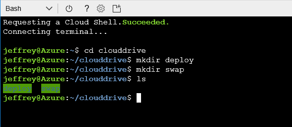
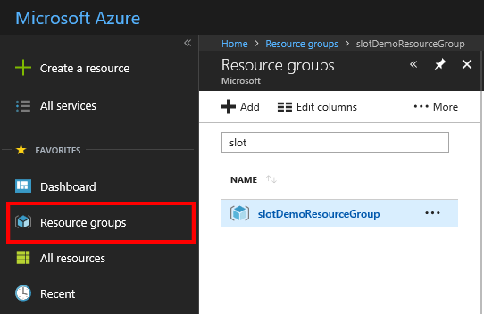
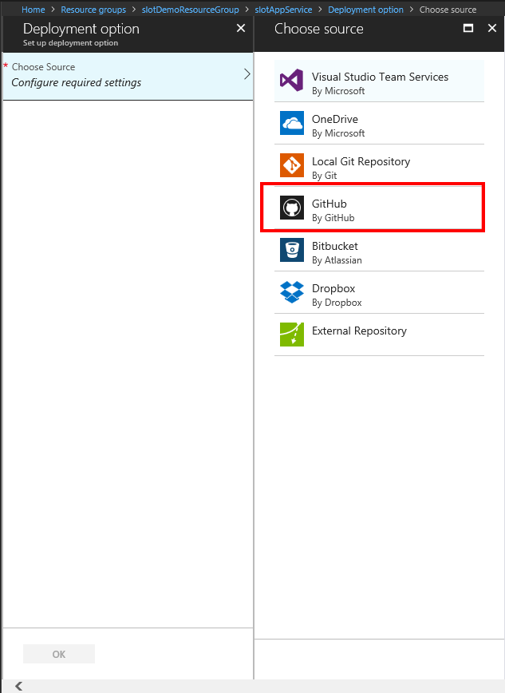
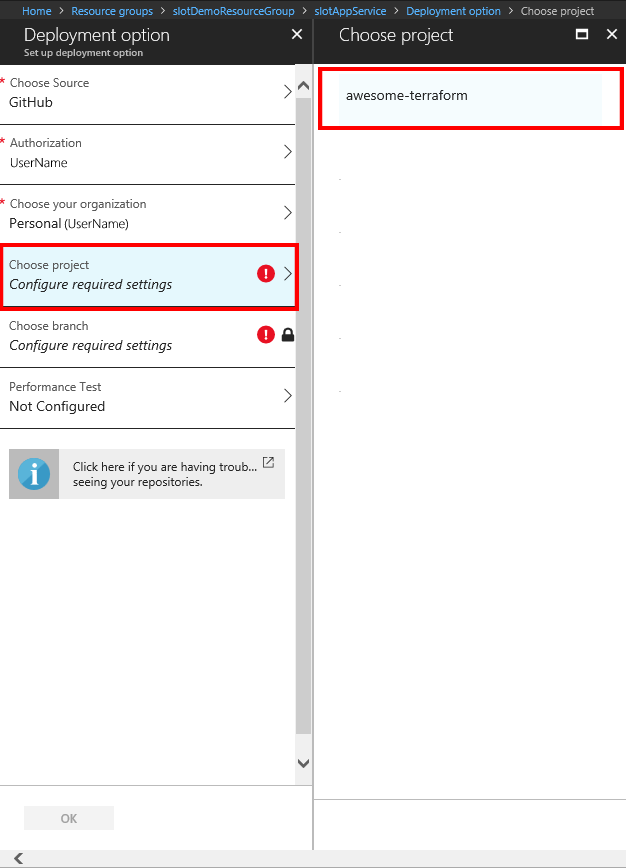
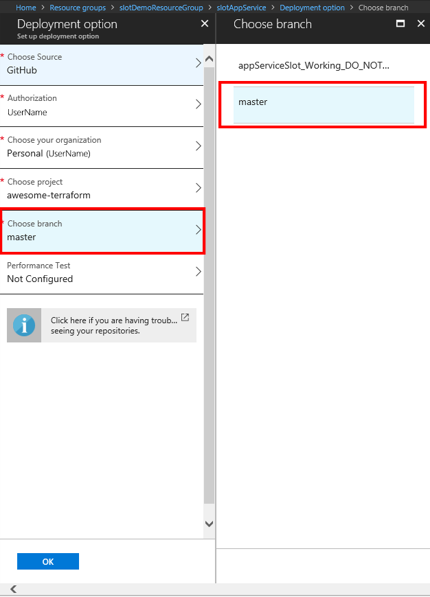
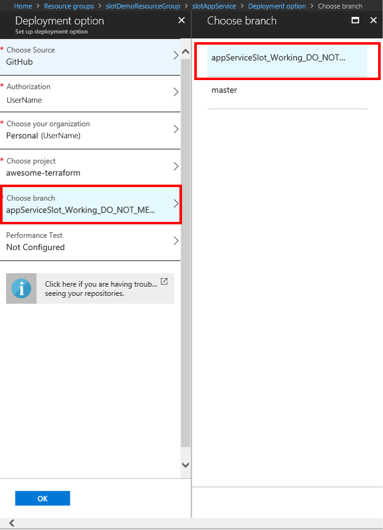
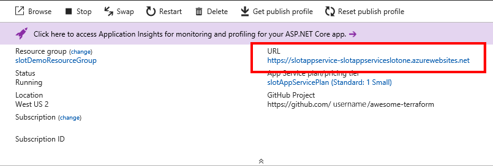
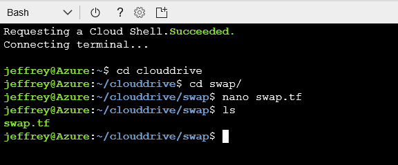

Terraform with Azure Provider Deployment Slot Walkthrough
===

In this walkthrough we will show you how to deploy two web apps via `GitHub` on `Azure`. One app will be assigned to the `Production Slot` and the second one will be hosted in the additional [deployment slot](https://docs.microsoft.com/en-us/azure/app-service/web-sites-staged-publishing) which we will provision with `Terraform`. Finally, we will use `Terraform` to swap the inactive slot with the `Production Slot`.

Using the [Azure Portal](https://portal.azure.com/) deploy a [Cloud Shell](https://docs.microsoft.com/en-us/azure/cloud-shell/overview), which is pre-configured with the latest version of `Terraform`. 

In the `Cloud Shell` bash window navigate to your `clouddrive` directory and create two directories, one called `deploy` and the other called `swap` as seen in the following image.



Navigate to your `deploy` directory and using `nano` copy and past the below `HCL` into a file called `deploy.tf`(i.e. `nano deploy.tf`).

```HCL
# Configure the Azure Provider
provider "azurerm" { }

resource "azurerm_resource_group" "slotDemo" {
  name = "slotDemoResourceGroup"
  location = "westus2"
}

resource "azurerm_app_service_plan" "slotDemo" {
  name                = "slotAppServicePlan"
  location            = "${azurerm_resource_group.slotDemo.location}"
  resource_group_name = "${azurerm_resource_group.slotDemo.name}"
  sku {
    tier = "Standard"
    size = "S1"
  }
}

resource "azurerm_app_service" "slotDemo" {
  name                = "slotAppService"
  location            = "${azurerm_resource_group.slotDemo.location}"
  resource_group_name = "${azurerm_resource_group.slotDemo.name}"
  app_service_plan_id = "${azurerm_app_service_plan.slotDemo.id}"
}

resource "azurerm_app_service_slot" "slotDemo" {
  name                = "slotAppServiceSlotOne"
  location            = "${azurerm_resource_group.slotDemo.location}"
  resource_group_name = "${azurerm_resource_group.slotDemo.name}"
  app_service_plan_id = "${azurerm_app_service_plan.slotDemo.id}"
  app_service_name    = "${azurerm_app_service.slotDemo.name}"
}
```
Once you have created the `deploy.tf` file you can now provision your resources to `Azure` using `Terraform` by typing the following commands.

```bash
terraform init
terraform plan
terraform apply
```

Once `Terraform` has completed provisioning the resources you can use the `Resource Groups` tab in the `Azure Portal` to see the resources that were just provisioned by `Terraform`.



Click on the `slotDemoResourceGroup` and this will show each of the resources that were created.


We will need a web app to deploy to our `deployment slots`, fork the [awesome-terraform](https://github.com/Azure/awesome-terraform) repository to your own personal organization by clicking on the fork button in `GitHub` as seen in the image below.


Deploying Bits from GitHub to your Deployment Slots
---

1. We now have our bits, let's set them up to deploy from `GitHub` via the [Azure Portal](https://portal.azure.com/). Locate your `Resource Group`, as stated previously in this document, and click on the `slotAppService` resource then click on `Deployment options` button, as seen in the following image.

    

3. Select the source of the deployment by clicking on the `GitHub` button as shown in the following image.

    

4. Once you have set up your Authorization and picked your personal organization we need to tell the `Azure Portal` which project we want to deploy from, click on the `Choose Project` option and select `awesome-terraform` from the displayed menu items.

    

5. Now that we have defined what project we would like to deploy from, we also need to select which branch we should deploy from click on the `Choose branch` button and select `master` from the displayed menu items and clike `OK`as seen in the folowing image.

    

Once you click `OK`, the `Azure Portal` will begin building the project and deploy it to your `slotAppService` production slot. 

To set up deployment to our `slotAppServiceSlotOne`, we will follow the same steps as above except in **Step 1** we will click on the `slotAppServiceSlotOne` resource and in **Step 5** you will select the `working` branch instead of the `master` branch, as seen in the image below.



Putting It All Together
---

At this point we have set up our `slotAppService` and our `slotAppServiceSlotOne` to deploy our `web app` from different branches in `GitHub`. You can now preview the `web app` to validate that it was successfully deployed to the `slots` by clicking on the `URL` on the resources `Overview` page, as seen in the image below.



 If everything was deployed correctly `slotAppService` should render a Blue page with the page title of **Slot Demo App 1** and the `slotAppServiceSlotOne` should render a Green page with the page title of **Slot Demo App 2**.

 In the browser you just validated the pages in, navigate to the `slotAppService` URL, this should be the page that renders in blue (do not close this browser window/tab). Now, go back to your `Azure Cloud Shell` session and navigate to the `swap` directroy we created in the previous step. On the `Azure Cloud Shell` command prompt type `nano swap.tf` then copy and paste the below `HCL` into the `nano` text editor and save the file.

```HCL
# Configure the Azure Provider
provider "azurerm" { }

# Swap the Production Slot with the Deployment Slot
resource "azurerm_app_service_active_slot" "slotDemoActiveSlot" {
  resource_group_name   = "slotDemoResourceGroup"
  app_service_name      = "slotAppService"
  app_service_slot_name = "slotappServiceSlotOne"
}
```



We now have the Terraform code to swap our `Production slot` with our `Deployment slot`, in the `Azure Cloud Shell` command prompt type the following commands.

```bash
terraform init
terraform plan
terraform apply
```

Once `Terraform` has finished swapping the slots go back to the browser session/tab that is rendering the `slotAppService web app` and refresh the page. You will notice that the `web app` that was in your `slotAppServiceSlotOne` deployment slot has been swapped with the `Production slot` and that the page now renders green. To bring back the original bits that was originally in the `Production slot` just run the `swap.tf` again by typing terraform apply and the original code will be swapped again from the `Deployment slot` to the `Production slot`.
